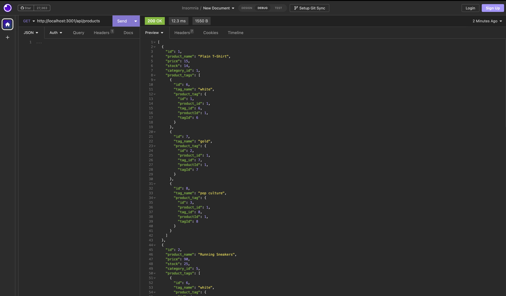

# E-commerce-Back-End

## Description

This application provides an e-commerce business with the ability to view, add, edit and delete database items. It utilizes express, mysql12 and sequelize. Additionally, MySQL Workbench is used to visually view the table as functions are performed and Imsomnia is used to run the endpoint operations.

## Installation

- Clone this repo
- Run `npm i` to install dependencies
- Update `.env` with your MySQL Workbench credentials

## Usage

- Run `npm start` in the terminal from the root folder to start the server

- Use the following endpoints in MySQL Workbench:
- `/api/tags` to view all tags
- `/api/tags/:id` to view specific tag
- `POST`, `PUT`, and `DELETE` on `/api/tags/` enpoint to add, edit and delete a tag.
- `/api/categories` to view all categories
- `/api/categories/:id` to view specific category
- `POST`, `PUT`, and `DELETE` on `/api/categories/` enpoint to add, edit and delete a category.
- `/api/products` to view all products
- `/api/products/:id` to view specific product
- `POST`, `PUT`, and `DELETE` on `/api/products/` enpoint to add, edit and delete a product.

## Video Link

[Video Demo](https://drive.google.com/file/d/1p_S_GD-wsIzsck1QCuzM56F20YG2MmWL/view)

### Screenshot of the project

## Credits

Eric Nguyen

## Questions

[Github Profile](https://github.com/ericnguyen23)

For any additional questions, please email me at ericnguyen23@gmail.com